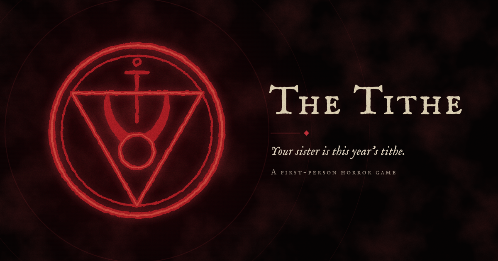
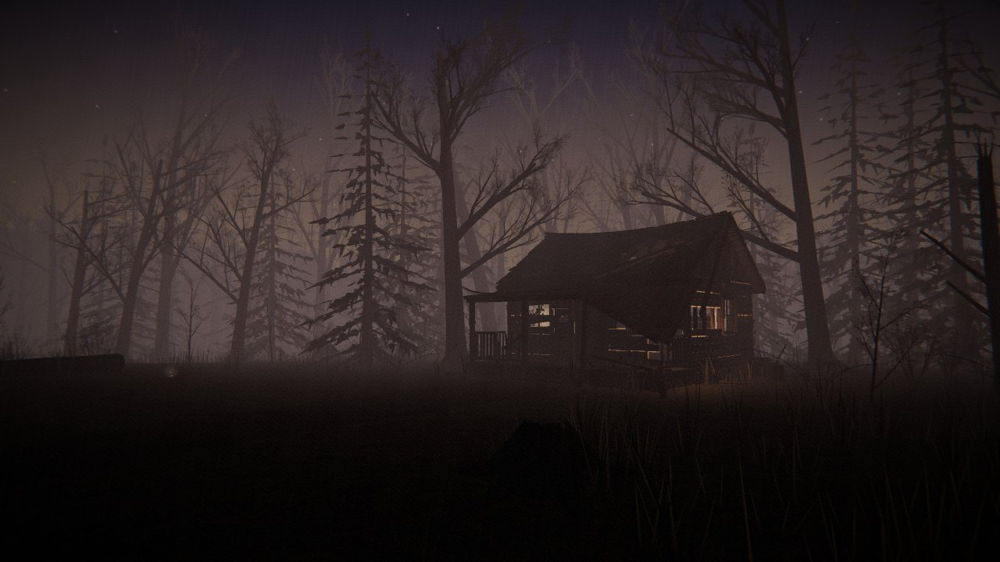
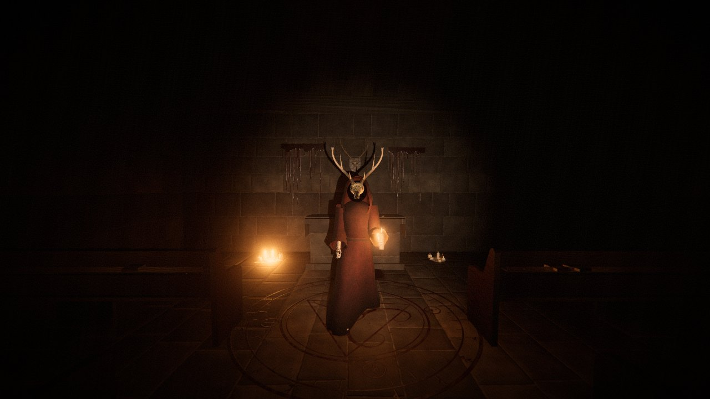
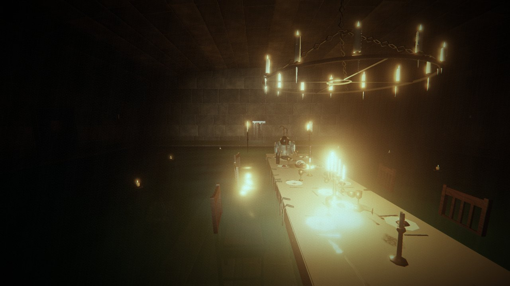
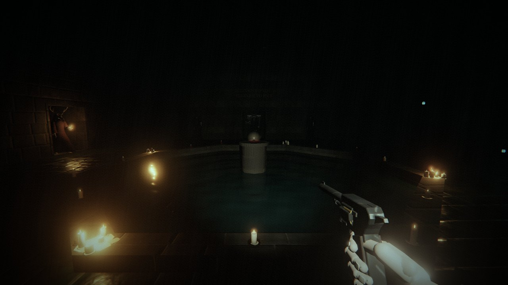
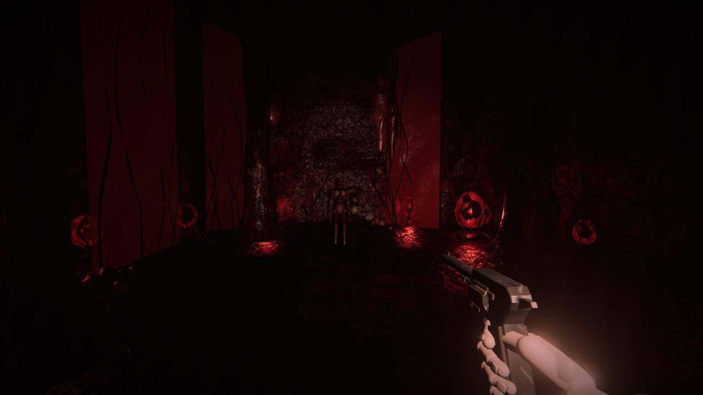
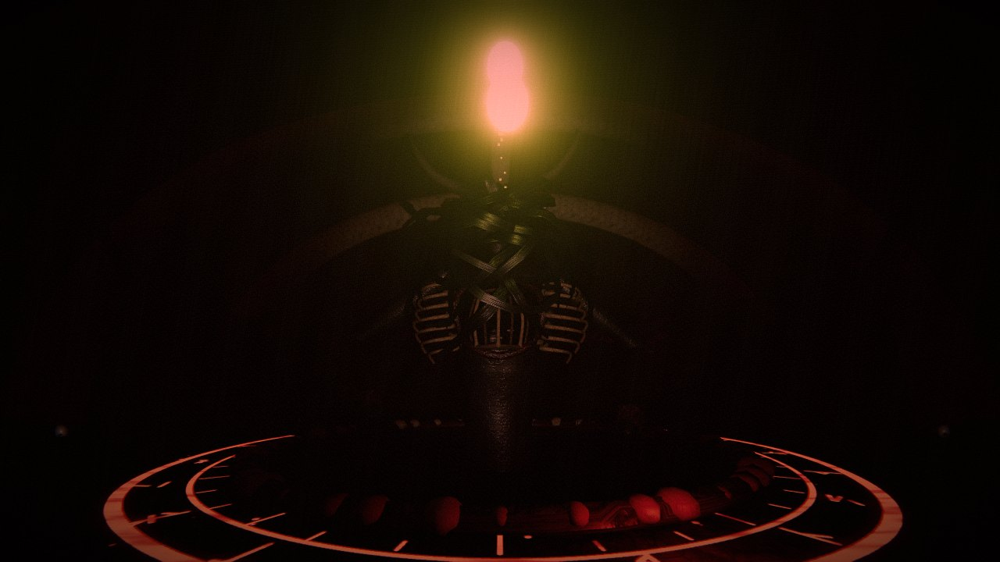

# The Tithe



A first-person horror game built with Three.js and Vite. **[Play it in your browser](https://miguelsolorio.github.io/the-tithe/)** (headphones recommended).

A year after your sister vanished, her phone pings from a field. At dusk you find a small cabin that is impossibly large inside. A cult drowned the lower house to keep a demon, the Mother Below, asleep, and your sister is this year's tithe. Go down through the house, kill the Mother Below, cut your sister free, and get out before the house floods.

Every model, texture and sound is generated in code. The only image files are the icons, the social preview and the screenshots below.

## Screenshots

<table>
  <tr>
    <td width="50%"><br /><sub>The field at dusk</sub></td>
    <td width="50%"><br /><sub>The blood chapel behind the library</sub></td>
  </tr>
  <tr>
    <td><br /><sub>The drowned dining room</sub></td>
    <td><br /><sub>The baptism pool in the cisterns</sub></td>
  </tr>
  <tr>
    <td><br /><sub>The womb, deep in the flesh caves</sub></td>
    <td><br /><sub>The Mother Below</sub></td>
  </tr>
</table>

## Run it

```bash
npm install
npm run dev
```

Open http://localhost:5199 and click **Begin**. Headphones recommended.

`npm run dev -- --mode stable` serves the same game without hot reload (the `the-tithe-stable` entry in `.claude/launch.json`, port 5299), which is handy for play-testing while editing.

## Controls

| Key | Action |
| --- | --- |
| W A S D | Move |
| Mouse | Look (click the game to lock the pointer) |
| Shift | Sprint |
| F | Flashlight |
| E | Interact / pick up |
| Left click | Attack (knife) / fire |
| R | Reload |
| 1 / 2 / 3 | Knife / revolver / shotgun |
| Esc | Pause (sensitivity and volume are in the pause menu) |

On phones and tablets (or with `?touch`), on-screen controls take over. Play with the device sideways:

| Touch | Action |
| --- | --- |
| Left thumb | Floating stick; push it to the rim to sprint |
| Right thumb | Drag to look |
| Crosshair button | Hold to attack; slide it to aim while firing |
| Hand button, or tap the prompt | Interact |
| Torch / reload buttons | Flashlight / reload |
| Item row | Tap a weapon to equip it |
| Pause button | Pause (also pauses when the app is switched away or the phone is turned upright) |

## The way down

1. **The field at dusk.** Follow the ringing phone. The sky darkens as time passes and as you near the cabin.
2. **Ground floor.** Find the knife in the blood chapel hidden behind a library bookshelf; it cuts the ropes on the grand stairs.
3. **Upstairs and attic.** The revolver and the fuse. The fuse powers the basement door in the kitchen.
4. **Flooded basement.** Wading slows you down. The crowbar opens the grate to the cisterns.
5. **Cistern tunnels.** The valve wheel opens the sluice gate to the ossuary crawlspace.
6. **Flesh caves.** The shotgun tears open the sphincter that seals the heart.
7. **The heart.** Kill the Mother Below, cut your sister free, and run back up through the flooding house to the field at dawn.

Checkpoints are saved each time you enter an area. Dying restarts the area; **Continue** on the title screen resumes the last checkpoint.

## Debug mode

Add `?debug` to the URL (http://localhost:5199/?debug). It shows an FPS counter (with draw calls, triangles and position) and exposes `window.game` in the browser console:

| Command | What it does |
| --- | --- |
| `game.teleport(level, spawn?)` | Jump to a level by id (`'field'`, `'ground'`, `'upstairs'`, `'basement'`, `'cistern'`, `'caves'`, `'heart'`), number 1–7 or name |
| `game.spawn(type, distance?)` | Spawn `acolyte`, `hound`, `drowned`, `lamprey`, `skinless`, `wallMaw` or `mother` in front of you |
| `game.give(item)` | `knife`, `revolver`, `shotgun`, `phone`, `fuse`, `crowbar`, `valve`, `ammo`, `shells`, `bandage` or `all` |
| `game.god(on?)` | Toggle god mode (no damage) |
| `game.kill()` | Kill every enemy in the level |
| `game.flag(name)` | Set a story flag |

`?debug&level=cistern` starts directly in a level with the items you would have by then. The debug build keeps running when its tab is hidden, and `game.place(x, z, lookX, lookZ)`, `game.press('KeyE')`, `game.wait(ms)` and `game.aimAt(v)` help script play-tests.

## Defaults and decisions

Choices made where the brief left room:

- **Bandages heal on pickup** (+40). There is no separate heal key, and a bandage stays on the ground if you are at full health.
- **Sprint is unlimited**, but sprinting and splashing are loud: enemies hear you from farther away.
- **Levels are separate areas** joined by stairs, ladders and hatches, with a short fade. That keeps each area fast to render and makes the cabin's small exterior and huge interior possible.
- **Key items open the next area**: phone → cabin door, knife → stair ropes, fuse → basement door, crowbar → cistern grate, valve wheel → sluice gate, shotgun → the sphincter to the heart.
- **Checkpoints** on entering each area (flags, inventory, health; at least half health), also kept in `localStorage` for **Continue**.
- **The knife never runs out**, so every area can be finished without ammo. The ritual knife does double damage to the Mother Below: she was bound with it.
- **Flashlight** has no battery; darkness is the challenge, and enemies see you from farther away when it is on.
- **Mouse sensitivity and volume** are in the pause menu.
- **HUD**: health bar at the bottom centre, the weapon and ammo just above it, key items top left.
- **Doors**: every regular doorway has a hinged door; they stay open once opened. Secret passages, archways and torn flesh openings have none.
- **Performance**: a fixed pool of 6 point lights follows the nearest candles, bulbs and glowing tissue; only the flashlight casts shadows; static geometry is merged per material.

## Project layout

- `src/main.js`: game loop and state (title, playing, paused, dead, ending)
- `src/engine/`: physics, navigation grid, levels and checkpoints
- `src/world/`: level builder, ASCII room plans, materials and textures, props, water, light pool
- `src/levels/`: the seven areas (`docs/level-api.md` explains how they are built)
- `src/entities/`: enemy AI, creature models, the Mother Below, your sister, pickups
- `src/player/`: first-person controller and weapons
- `src/systems/`: audio, post-processing, HUD helpers, debug
- `tools/`: standalone viewers for materials, props, creatures and sounds (`npm run dev`, then open e.g. http://localhost:5199/tools/creatures.html)
- `docs/`: visual and audio direction, level API, screenshots
- `branding/`: the sigil icon and social preview (`sigil.html`) and `render.mjs`, which renders them into `public/` (`node branding/render.mjs`) and retakes the screenshots from a running dev server (`node branding/render.mjs shots`)
- `public/`: favicon, app icons, web manifest and the social preview image
